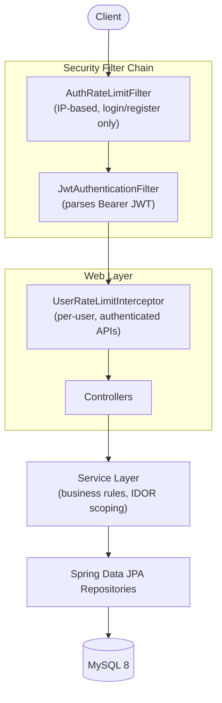
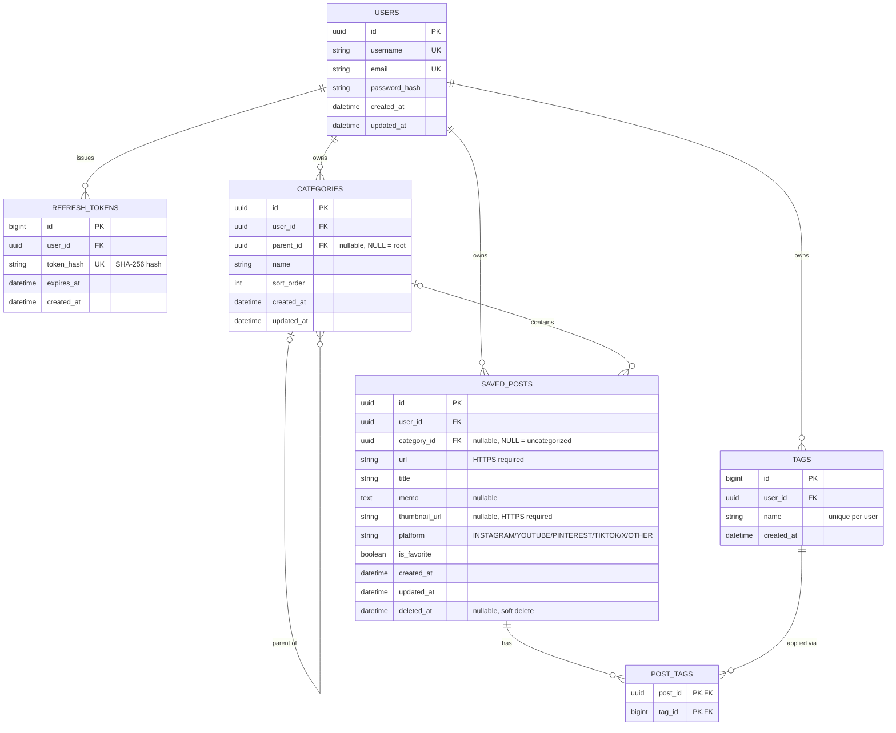

# post-collector

A Spring Boot REST API to collect and organize social media posts by category and tag — no matter which platform they came from.


**Live Demo**: https://post-collector-production.up.railway.app
**API Docs (Swagger UI)**: https://post-collector-production.up.railway.app/swagger-ui.html

---

## Overview

Post Collector is a REST API for saving and organizing posts from social media platforms (Instagram, YouTube, Pinterest, TikTok, X, and more) into hierarchical categories and cross-cutting tags — regardless of which platform each post came from.

### Why I built this

I frequently save posts and videos across several different SNS apps, and each app lets me organize what I saved *within that app* — but never *across* apps. That meant I'd often forget which app I'd saved something in ("was that reel on Instagram or was it a YouTube Short?"), and I had no way to pull up "everything I saved under this topic" across platforms at once. This project is my answer to that: a single place to save a post from any platform, tag and categorize it the same way regardless of source, and find it again later.

**Who it's for**: people who save posts often and lose track of which app they saved them in, and anyone who wants to manage saved content from multiple SNS platforms in one place.

---

## Features

* **Centralized multi-platform post collection**: save posts from Instagram, YouTube, Pinterest, TikTok, X, and other platforms with a URL, title, memo, thumbnail, platform, and favorite status.
* **Hierarchical category organization**: organize saved posts into categories up to 3 levels deep, with validation that prevents invalid depth and cyclic relationships.
* **Cross-cutting tags**: apply reusable tags across categories so posts can be grouped by topic independently of their category structure.
* **Flexible search and filtering**: filter posts by category, platform, tag, favorite status, or keyword, with pagination, sorting, and keyword search across titles and memos.
* **Secure account and session management**: user registration, login, logout, JWT access-token authentication, and refresh-token based session renewal.

## Technical Highlights

Beyond CRUD, this project focuses on several backend design and reliability concerns:

* **Secure token lifecycle, not just JWT authentication**: authentication is stateless with Spring Security and short-lived JWT access tokens, while refresh tokens are generated with `SecureRandom`, stored only as SHA-256 hashes, delivered through an HttpOnly cookie, and rotated on every refresh so a previously issued token cannot be reused after rotation.

* **Query design that explicitly addresses N+1 problems**: post search is built with composable Spring Data JPA `Specification`s, categories are fetched with `@EntityGraph`, and tags are batch-loaded for the current page instead of queried once per post. Category post counts are also aggregated in a single query before the category tree is assembled in memory.

* **Layered automated testing against a real database**: 335 tests cover service, repository, controller, and full integration layers using JUnit 5, Mockito, MockMvc, and Testcontainers. Repository and integration tests run against MySQL rather than an in-memory substitute, with approximately 97% line and branch coverage and an 80% JaCoCo coverage gate enforced during the build.

* **Hierarchical data integrity beyond basic CRUD**: category moves validate both cycles and the resulting subtree depth, preventing a category from becoming its own ancestor or causing the hierarchy to exceed the 3-level limit. Category trees are then constructed from pre-grouped data without issuing a query for every node.

* **User ownership enforced at the data-access boundary**: user-owned resources are queried with both the resource ID and authenticated user ID, so unauthorized resources are never retrieved and filtered afterward. Missing and non-owned resources therefore follow the same not-found path rather than exposing whether another user's resource exists.

* **Context-aware rate limiting**: unauthenticated login and registration requests are rate-limited by client IP in a security `Filter`, while authenticated API requests are limited per user in a `HandlerInterceptor` after Spring Security has resolved the user identity.

* **True partial-update semantics**: PATCH-style post updates distinguish between an omitted field and a field explicitly set to `null`, allowing optional values such as memo, thumbnail, and category to be intentionally cleared without treating omission as deletion.

* **Centralized soft-delete behavior**: saved posts use Hibernate `@SQLRestriction` so records marked with `deleted_at` are automatically excluded from normal entity queries instead of requiring every repository query to repeat the same condition.


## Tech Stack

| Category | Choice | Why |
|---|---|---|
| Language | Java 21 | Records for DTOs, pattern-matching `instanceof` for cleaner null/type checks |
| Framework | Spring Boot 3.5 | |
| Security | Spring Security + JWT | Stateless auth fits a REST API; access token in the response body + refresh token in an HttpOnly cookie balances usability against XSS exposure |
| Database | MySQL 8 | Relational fit for hierarchical categories and many-to-many tag associations |
| ORM | Spring Data JPA / Hibernate | Productivity, paired with explicit attention to its sharp edges (dirty-checking/flush timing, N+1 avoidance via `@EntityGraph`, soft-delete via `@SQLRestriction`) |
| Rate limiting | Bucket4j | Lightweight token-bucket implementation; no external dependency (Redis, etc.) needed for a single-instance deployment |
| Testing | JUnit 5, Mockito, Testcontainers | Testcontainers runs tests against a real MySQL instance rather than H2, so tests exercise the actual SQL/constraints that will run in production |
| Coverage | JaCoCo | |
| API Docs | SpringDoc OpenAPI (Swagger UI) | |
| Infrastructure | Docker Compose | Reproducible local MySQL instance |
| Deployment | Railway | Dockerfile-based deploy; MySQL as a managed plugin service |

## Architecture



### ER Diagram



## Testing & Quality

Testing is split across four layers, each with a deliberately different scope so nothing is re-verified redundantly across layers:

| Layer | Tool | What it covers |
|---|---|---|
| Service | JUnit 5 + Mockito | Business rules and branch logic, with dependencies mocked |
| Repository | `@DataJpaTest` + Testcontainers | Custom queries and dynamic `Specification` filters against a real MySQL instance |
| Controller | `@WebMvcTest` + MockMvc | HTTP status codes, request validation, and Spring Security behavior |
| Integration | `@SpringBootTest` + Testcontainers | End-to-end flows through the full stack — real JWTs, cross-user access checks, and `@Transactional` rollback behavior — that no single layer above can verify on its own |

**335 tests** across 22 test classes, **~97% line / ~97% branch coverage** (enforced at 80% minimum via JaCoCo; run `./mvnw test` to see the current report at `target/site/jacoco/index.html`).

## API Example

```bash
# Register
curl -X POST http://localhost:8080/api/v1/auth/register \
  -H "Content-Type: application/json" \
  -d '{"username":"alice","email":"alice@example.com","password":"password123"}'

# Log in
curl -X POST http://localhost:8080/api/v1/auth/login \
  -H "Content-Type: application/json" \
  -d '{"email":"alice@example.com","password":"password123"}'
# -> { "accessToken": "...", "tokenType": "Bearer", "expiresIn": 900 }

# Save a post (with the access token from above)
curl -X POST http://localhost:8080/api/v1/posts \
  -H "Authorization: Bearer <accessToken>" \
  -H "Content-Type: application/json" \
  -d '{"url":"https://instagram.com/p/xyz","title":"Great recipe","platform":"INSTAGRAM"}'
```

Full interactive API documentation is available via Swagger UI once the app is running (see below).

## Getting Started

**Prerequisites**: Java 21, Docker

```bash
# 1. Clone and configure environment variables
git clone https://github.com/Haru73376/post-collector.git
cd post-collector
cp .env.example .env
# edit .env: set DB_USERNAME, DB_PASSWORD, DB_ROOT_PASSWORD, JWT_SECRET

# 2. Start MySQL
docker compose up -d

# 3. Run the app
./mvnw spring-boot:run

# 4. Open Swagger UI in your browser
# http://localhost:8080/swagger-ui.html
```

**Run the tests** (requires Docker, since Repository/Integration tests use Testcontainers):

```bash
./mvnw test
```
